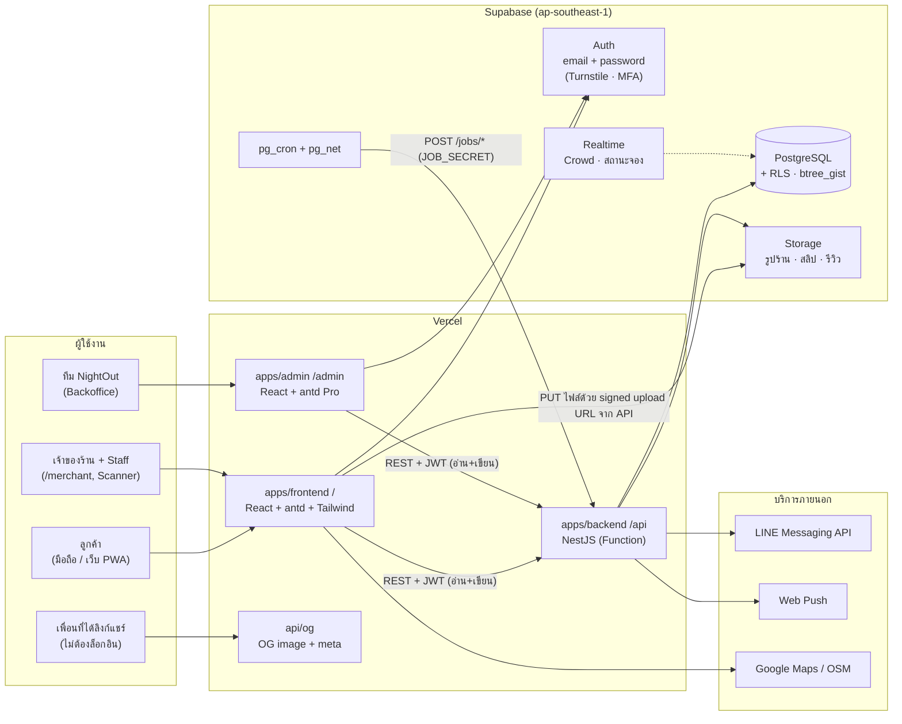
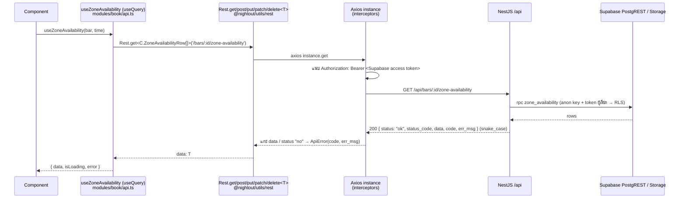
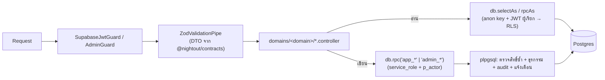
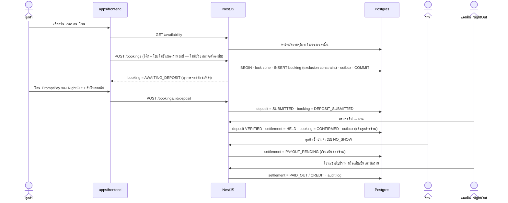
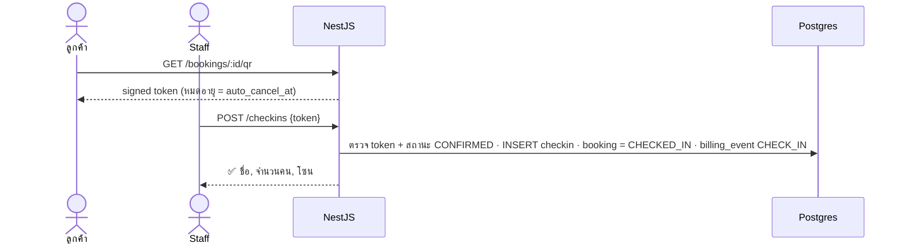
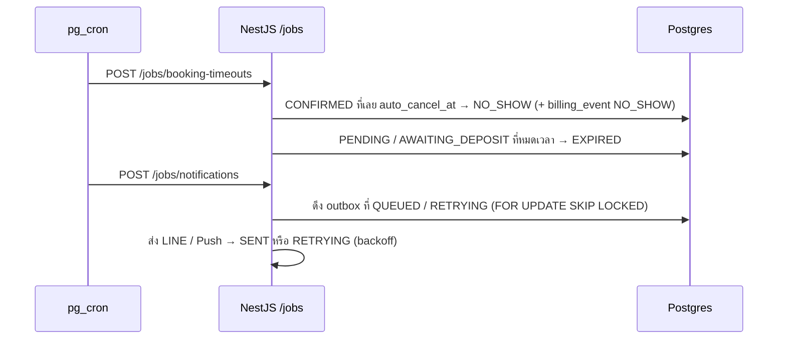
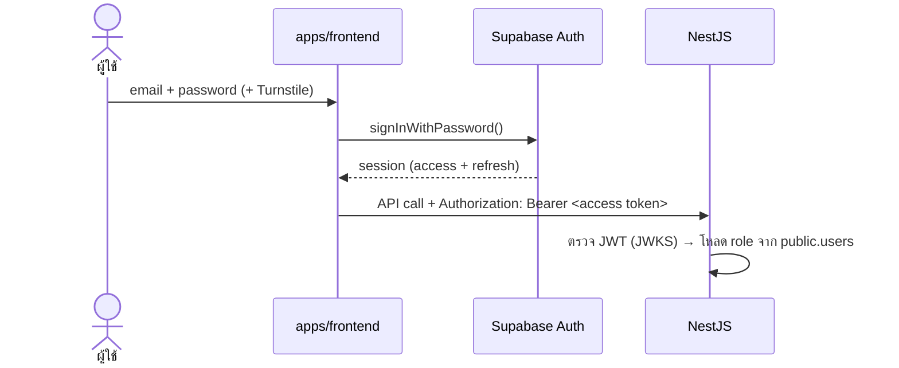

# NightOut — Architecture

> สถานะ: **Draft v0.4** · ใช้คู่กับ [`PROMPT.md`](PROMPT.md) (สเปค) และ [`SITEMAP.md`](SITEMAP.md) (หน้าเว็บ)

## 1. ภาพรวมระบบ



**หลักคิด 4 ข้อ**
1. **เขียนผ่าน API เท่านั้น:** การจอง สถานะ เช็กอิน มัดจำ ค่าคอม และโปรโมท ต้องผ่าน NestJS ทุกครั้ง เพื่อให้มีการตรวจกฎธุรกิจและ transaction ครบ
2. **หน้าเว็บอ่านผ่าน API ด้วย (ADR 0002):** `apps/frontend` ไม่ query DB / Storage ตรงอีกแล้ว — ใช้ Supabase เฉพาะ Auth · NestJS อ่าน view/RPC เดิม **ในนามผู้เรียก** (anon key + access token ของผู้ใช้) RLS จึงยังเป็นด่านเดียวกับเดิม · Backoffice `apps/admin` ก็เช่นกัน ([ADR 0003](adr/0003-migrate-admin-direct-db-calls-to-backend-api.md))
3. **Serverless-friendly:** NestJS บน Vercel ไม่ถืองานค้างไว้เอง งานตั้งเวลาทั้งหมดให้ `pg_cron` เป็นตัวเรียก
4. **โค้ดกฎธุรกิจชุดเดียว:** ตารางเปลี่ยนสถานะ ตัวคำนวณราคา และตัวคำนวณดาว อยู่ใน `packages/utils` แล้วใช้ร่วมกันทั้ง frontend และ backend

---

## 2. Layers

| Layer | อยู่ที่ | หน้าที่ |
|---|---|---|
| Presentation | `apps/frontend`, `apps/admin` | UI, routing, state ฝั่ง client และ form validation |
| Shared UI / DB types | `packages/ui`, `packages/types` | theme tokens, คอมโพเนนต์ร่วม, enum กลาง, type ของแถว view/ตาราง (`Db.*`) |
| Domain logic (pure) | `packages/utils` | price calculator, star → tier, status transition map |
| Client cache | `packages/mock` | store ในเบราว์เซอร์ที่ `services/sync.ts` เติมข้อมูลจาก API (ชื่อเดิมจากยุคเดโม — ไม่มีโหมดเดโมแล้ว) + model ที่หน้าเว็บใช้ |
| Map | `react-leaflet` + OpenStreetMap | แผนที่ร้าน (หน้าร้าน, หน้าค้นหา, หน้า `/map` เต็มจอ) พื้นแผนที่ vector tiles ฟรีจาก OpenFreeMap (ไม่ต้องมี key) + MapLibre ผ่าน `@maplibre/maplibre-gl-leaflet` แทนสีเป็นพาเลต Google Maps (ปกติ/กลางคืน) ใน `ui/utils/mapStyle.ts` · สำรอง: OSM raster + CSS filter หรือ `VITE_MAP_TILE_URL_*` ไม่ต้องมี API key · ปุ่มนำทางเปิด Google Maps |
| API | `apps/backend/src` (controllers) | controller, guard, pipe, Swagger |
| API contract | `packages/contracts` | zod ของ body / query / response + รหัส error 1 ไฟล์ต่อโดเมน — backend ใช้ทำ DTO/Swagger · หน้าเว็บใช้เป็น type ([ADR 0006](adr/0006-domain-sliced-api-and-shared-contracts.md)) |
| Application | `apps/backend/src/domains/<domain>` | 1 โดเมน = 1 module · controller แยกตามคนเรียก (public / me / merchant / admin) → ฟังก์ชัน DB |
| Data / Domain logic | `apps/backend/supabase` | migrations, RLS, **ฟังก์ชัน `app_*` / `admin_*` (กฎธุรกิจ + ธุรกรรม + ตรวจสิทธิ์)**, seed |
| Infra | `infra/terraform`, `.github/workflows` | Vercel, Supabase, secrets, CI/CD |

---

## 3. Frontend (`apps/frontend`, `apps/admin`)

### Stack
- React 19 + TypeScript + Vite + React Router
- **antd v6** เป็นคอมโพเนนต์หลักทั้ง 2 แอป (`apps/admin` ใช้ ProComponents เพิ่ม)
- **Tailwind CSS** ใช้กับ layout / spacing / responsive / ตัวตกแต่ง (gradient, glow) เท่านั้น ไม่ใช้สร้างคอมโพเนนต์ซ้ำกับ antd
- **Phosphor Icons** (`@phosphor-icons/react`) ใช้ทั้งหมด รวมถึงดาวคะแนน (`<Star weight="fill" />`)
- TanStack Query (server state), Zustand (UI state เล็กๆ เช่น bottom sheet และตัวกรอง), Motion

### antd + Tailwind อยู่ร่วมกันยังไง
- `ConfigProvider` ตัวเดียวที่ root ใส่ Midnight Gold token และ `darkAlgorithm` / `defaultAlgorithm`
- ใช้ `StyleProvider layer` ของ antd ร่วมกับ Tailwind v4 `@layer` โดยลำดับคือ `theme, base, antd, components, utilities` เพื่อไม่ให้ Tailwind preflight ไปทับ antd
- สีทั้งหมดมาจาก `packages/ui/tokens.ts` ไฟล์เดียว แล้วสร้างทั้ง **antd theme** และ **Tailwind CSS variables** จากไฟล์นี้
- ห้าม override `.ant-*` แบบ global ให้ใช้ token → component token → `classNames` / `styles` ตามลำดับ

### โครงภายในแอป (module-based — อิงโครง [thirddeity/pre-project](https://github.com/thirddeity/pre-project))
ทั้ง `apps/frontend` และ `apps/admin` จัดโฟลเดอร์แบบเดียวกัน — หาไฟล์ของหน้าไหนก็เปิด `modules/<ชื่อหน้า>/page.tsx`
```
apps/frontend/src/
├── main.tsx              # จุดเริ่ม: render <App />
├── App.tsx               # providers: Theme → React Query → Auth → Router
├── configs/              # ค่าตั้งกลาง (dayjs, query, interval ของเดโม)
├── router/
│   ├── index.tsx         # route ทั้งหมด (ตาม SITEMAP.md)
│   └── middleware.tsx    # RequireAuth / RequireRole (layout route guard)
├── layouts/              # main.tsx (floating island navbar) · auth.tsx (login 2) · merchant.tsx
├── modules/              # 1 โฟลเดอร์ = 1 หน้า (camelCase) → page.tsx
│   ├── home/
│   │   ├── page.tsx
│   │   ├── api.ts        # ทุก API ที่โมดูลนี้ใช้ (Rest + useQuery + key) — ADR 0007
│   │   ├── components/   # ใช้เฉพาะหน้านี้ (hero.tsx, categoryRow.tsx)
│   │   └── type/         # type ของหน้านี้
│   ├── login/ register/ forgotPassword/ resetPassword/ verifyEmail/ acceptInvite/
│   ├── ranking/ search/ barDetail/ barReviews/ book/ bookings/ bookingDetail/ deposit/ ...
│   └── merchant/<ชื่อหน้า>/page.tsx   # dashboard, tonight, bookings, deposits, store, menu ...
├── hooks/                # custom hooks ใช้ข้ามหน้า (useDemo, useNow, useScrolled, useMerchantBar)
├── services/             # ของกลางที่ไม่ใช่ API รายหน้า: sync.ts (store ของ catalog / overview) · mappers/<domain>.ts · data.ts (อ่าน store) · api/storage.ts (อัปโหลด) · auth.tsx · supabase.ts (Auth เท่านั้น) · admin: adminData.ts (useAdminView / useAdminAction)
├── ui/
│   ├── components/       # component ใช้ข้ามหน้า (navbar, barCard, authCard, pageHeader ...)
│   └── utils/            # format.ts ฯลฯ
└── styles/index.css      # Tailwind + @layer + class ตกแต่งเล็กน้อย
```
- รายชื่อโมดูลทั้งหมดของทั้งสองแอป → [STRUCTURE.md](STRUCTURE.md) (เพิ่ม/ลบ/เปลี่ยนชื่อโมดูลต้องแก้ไฟล์นั้นด้วย)
- กติกา: ของที่ใช้ **หน้าเดียว** อยู่ใน `modules/<หน้า>/components|type|form|modal|utils` · ใช้ **หลายหน้า** ย้ายไป `ui/` หรือ `hooks/`
- **API ของหน้า** (ADR 0007): ทุกเส้นที่โมดูลใช้อยู่ `modules/<หน้า>/api.ts` ของโมดูลนั้นเสมอ — เรียก `Rest` + `useQuery` ในไฟล์นั้น · 2 โมดูลใช้เส้นเดียวกัน = ประกาศซ้ำในแต่ละ `api.ts` ได้ (ไม่ import ข้ามโมดูล) · component ใช้ข้ามหน้าใน `ui/` ที่เรียก API เอง ประกาศเส้นนั้นในไฟล์ component (เช่น `favoriteButton.tsx`)
- ชื่อไฟล์ component เป็น camelCase (`barCard.tsx`) ส่วน export เป็น PascalCase (`BarCard`)
- รูป/วิดีโอใน `public/images/<module>/` และ `public/videos/`
- `@nightout/*` ใน dev ถูก alias ไปที่ `packages/*/src` (vite.config.ts) — แก้ package แล้วเห็นผลทันที ไม่ต้องรอ build
- **API client** = class `Rest` ใน `packages/utils/src/rest.ts` (`import { Rest } from '@nightout/utils/rest'`) ใช้ร่วมกันทั้ง `apps/frontend` และ `apps/admin` — ดูหัวข้อ Data Flow Standard ด้านล่าง · (type ของ body/response มาจาก `@nightout/contracts` ชุดเดียวกับที่ backend ใช้ทำ DTO — ADR 0006)
- **Guard ของ route** (`RequireAuth`, `RequireRole`) ห่อที่ระดับ layout route ใน React Router

### Data Flow Standard (ADR 0002 + 0006 + 0007) — ✅

```
Component → modules/<หน้า>/api.ts (Rest + TanStack Query) → Rest → Backend domains/<domain> → Supabase (RLS)
                    ↑ type/body จาก @nightout/contracts/<domain>
```



| ชั้น | ไฟล์ | หน้าที่ |
|---|---|---|
| Component | `modules/*/page.tsx` + `components/ modal/ form/ hooks/` ของโมดูล | แสดงผล เรียก hook / ฟังก์ชันจาก `./api` ของโมดูล — **ห้าม** import `supabase`, `axios` |
| API ของหน้า | `modules/<หน้า>/api.ts` | ทุกเส้นที่โมดูลใช้: `Rest.get/post/…` (body `satisfies C.XBody` · response `C.XResult`) + `useQuery` (key ขึ้นต้นชื่อโดเมน) · เขียนแล้ว Rest โหลด store ใหม่ให้เอง (`afterWrite` → `refreshAfterWrite`) · Backoffice: view hook (`useAdminView('admin_x', opts)`) + action builder (`xAction(…): AdminActionInput`) |
| Store | `services/sync.ts` (โหลด catalog / overview ลง store + snapshot) · `services/mappers/<domain>.ts` (แถว DB → model หน้าเว็บ) · `services/data.ts` (หน้าอ่าน store ผ่านที่นี่) | ข้อมูลที่ทุกหน้าใช้ร่วม |
| Rest + Axios Client | `packages/utils/src/rest.ts` (class `Rest` ใช้ร่วมทุกแอป) | `Rest.configure({ baseURL, getAccessToken, logger, unauthorizedCode, errorMessages: ERROR_MESSAGES })` ครั้งเดียวใน `main.tsx` ของแต่ละแอป → `axios.create` + interceptor แนบ Bearer token · แกะ envelope `ApiResponse` คืน `data` · `status: "no"` / HTTP error → `ApiError(status, code)` ข้อความ = `err_msg` จาก API (สำรอง: `errorMessages`) · log · `Rest.get/post/put/patch/delete<T>` · `Rest.upload(url, file)` · `Rest.ping()` |
| Backend API | `apps/backend/src/domains/<domain>/*` | ตรวจ JWT + validate (DTO จาก contracts) แล้วอ่าน/เขียน Supabase · อ่านทำในนามผู้เรียก (RLS) · เขียนผ่านฟังก์ชัน `app_*` / `admin_*` |

**Endpoint อ่านที่ย้ายมาจากการ query ตรง** (ตอนนี้อยู่ใน `domains/<domain>/*.controller.ts` ของแต่ละโดเมน)

| เดิม (หน้าเว็บ → Supabase) | ตอนนี้ (หน้าเว็บ → API) |
|---|---|
| `bar_detail`, `public_reviews`, `districts`, `styles`, `platform_settings`, `promotion_packages` | `GET /public/catalog` |
| `public_team` | `GET /public/team` |
| rpc `zone_availability` | `GET /bars/:barId/zone-availability?datetime=` |
| rpc `get_share_card` | `GET /share-cards/:token` |
| `users` (โปรไฟล์ของฉัน) | `GET /me/profile` |
| `booking_detail`, `notifications`, `my_favorites`, `my_reviews`, `user_preferences`, `my_bar_detail`, `review_reports`, `promoted_listings` | `GET /me/overview` |
| rpc `my_invites` | `GET /me/invites` |
| rpc `bar_team`, `bar_deposit_ledger`, `billing_events` | `GET /merchant/bars/:barId/team` · `/deposit-ledger` · `/billing-events` |
| (admin) view `admin_*` + filter/order/limit | `GET /admin/views/:view?<คอลัมน์>=<ค่า>[,…]&order=<คอลัมน์>.asc\|desc&limit=` (whitelist view · ADMIN + MFA) |
| (admin) rpc `admin_dashboard` | `GET /admin/dashboard` |
| (admin) `styles`, `safety_features`, `platform_settings` | `GET /admin/master/:table?order=` |
| `storage.upload()` | `POST /storage/upload-url` → PUT ไฟล์เข้า URL ที่ได้ (ไฟล์ใหญ่ไม่ผ่าน Vercel Function) |
| `storage.createSignedUrl(s)` | `POST /storage/signed-urls` |

**กติกา**
- ใช้ `supabase` ได้เฉพาะ `supabase.auth.*` ทั้ง `apps/frontend` และ `apps/admin` — ESLint (`eslint.config.js` ของแต่ละแอป) บล็อก `supabase.from / rpc / storage / schema / channel`
- Backoffice ใช้แบบเดียวกัน: `modules/<หน้า>/api.ts` ประกาศ view + action ของหน้า → hook กลางใน `services/adminData.ts` (`useAdminView` · `useAdminAction` invalidate key `['admin']` ทั้งหมด · `useSignedUrl`) → `Rest` ตัวเดียวกับหน้าเว็บ (ตั้ง `unauthorizedCode: 'MFA_REQUIRED'`)
- `Rest` อยู่ใน entry แยก `@nightout/utils/rest` — backend ที่ import `@nightout/utils` (ตัวคำนวณราคา ฯลฯ) จึงไม่โหลด axios · ดู [ADR 0004](adr/0004-shared-rest-client.md)
- ข้อมูลใหม่ที่ต้องอ่าน: zod/type ใน `packages/contracts/src/<domain>.ts` → endpoint ใน `domains/<domain>` (มี `@ApiDoc`) → hook `useQuery` ใน `modules/<หน้า>/api.ts`
- การเขียน: body ใน contracts → endpoint → ฟังก์ชันใน `modules/<หน้า>/api.ts` ที่เรียก `Rest.post/put/patch/delete<T>()` อย่างเดียว — POST/PUT/PATCH/DELETE ที่สำเร็จ Rest รอ `afterWrite` (frontend: `refreshAfterWrite` ใน `services/sync.ts` โหลด `/me/overview` และ `/public/catalog` ถ้าเป็นข้อมูลหน้าร้าน) ก่อนคืนผล (ใช้กับ `useMutation` ได้ตรงๆ)
- `VITE_API_BASE_URL` ว่างได้: dev = `http://localhost:3000/api`, deploy = `/api` (same-origin) · `VITE_API_URL` เดิมยังอ่านเป็นค่าสำรอง

### Component style — ✅ Function component + hooks
- เขียนทุก component เป็น function + hooks ตาม standard React (antd, TanStack Query, React Router และ Motion ออกแบบมาให้ใช้แบบนี้)
- **ไม่ใช้ class component** ยกเว้น `ErrorBoundary` (React ยังต้องเขียนเป็น class)
- **HOC** ใช้เฉพาะเรื่องที่ครอบหลายหน้า เช่น `withErrorBoundary` ส่วนเรื่องสิทธิ์ใช้ layout route `<RequireAuth>` / `<RequireRole role="MERCHANT">`
- logic ที่ใช้ซ้ำให้แยกเป็น custom hook เช่น `useBooking(id)`, `useAvailability(...)`, `useThemeMode()`

---

## 4. Backend (`apps/backend`) — จัดตามโดเมน (ADR 0006)

```
apps/backend/
├── src/
│   ├── main.ts / bootstrap.ts      # เริ่ม NestJS (local) / สร้าง app ให้ Vercel Function · prefix /api · Swagger /api/docs (tag = โดเมน)
│   ├── auth/                       # SupabaseJwtGuard (JWKS → fallback /auth/v1/user) · AdminGuard (ADMIN/SUPER_ADMIN + aal2) · SuperAdminGuard
│   ├── common/                     # @ApiDoc · clientInfo (IP/UA) · params (Id / BarId / BookingId + ข้อความ forbidden)
│   ├── supabase/supabase.service.ts  # ตัวเดียวที่คุย Supabase: rpc (service_role) · selectAs/rpcAs (ในนามผู้เรียก) · storage · auth admin · errcode → HTTP
│   ├── domains/<domain>/           # 1 โดเมน = 1 module (ชื่อเดียวกับ packages/contracts/src/<domain>.ts ที่หน้าเว็บเรียกจาก modules/<หน้า>/api.ts)
│   │   ├── <domain>.module.ts
│   │   ├── <domain>.public.controller.ts    # ไม่ต้องล็อกอิน (ส่ง token ต่อถ้ามี → RLS)
│   │   ├── <domain>.me.controller.ts        # ผู้ใช้ที่ล็อกอิน (SupabaseJwtGuard)
│   │   ├── <domain>.merchant.controller.ts  # ทีมร้าน (ฟังก์ชัน DB ตรวจ bar_staff + บทบาท)
│   │   ├── <domain>.admin.controller.ts     # Backoffice (SupabaseJwtGuard + AdminGuard · /admin/*)
│   │   ├── <domain>.dto.ts                  # class XDto extends createZodDto(C.XBody) — zod อยู่ใน @nightout/contracts
│   │   └── <domain>.service.ts              # มีเมื่อมี logic มากกว่าเรียก rpc 1 ครั้ง (account-users, payout-crypto, pricing)
│   ├── jobs/  health/  config/     # /api/jobs/* ให้ pg_cron เรียก · health · ตรวจ env ด้วย zod
├── supabase/                       # config.toml, migrations/, seed.sql — pnpm --filter @nightout/backend db:*
└── api/index.js                    # Vercel Function entry
```

| โดเมน | เรื่อง | controller ที่มี |
|---|---|---|
| `catalog` | ข้อมูลตั้งต้นของเว็บ (ร้าน รีวิว ย่าน สไตล์ ตั้งค่า แพ็กเกจ) | public |
| `booking` | จอง ยกเลิก สถานะ เช็กอิน ย้ายโต๊ะ โซนว่าง บัตรแชร์ | public · me · merchant |
| `deposit` | ส่งสลิป ตรวจสลิป ปิดยอด คืนมัดจำ สมุดมัดจำ | me · merchant · admin |
| `review` | เขียน รายงาน จัดการรีวิว | me · admin |
| `bar` | สมัครลงร้าน ข้อมูลร้าน เมนู โปร ค่าธรรมเนียม โซน Safety ตั้งค่าการจอง บัญชีรับเงิน ความแน่น อนุมัติ/ระงับ | me · merchant · admin |
| `bar-team` | ทีมร้าน: เชิญ นำออก คำเชิญของฉัน | me · merchant |
| `account` | โปรไฟล์ ข้อมูลของฉัน แจ้งเตือน ร้านโปรด ลบบัญชี · ผู้ใช้ ชั้นบัญชี แบน (Backoffice) | me · admin |
| `promotion` | โปรโมทร้าน: ซื้อแพ็กเกจ ตรวจคำสั่งซื้อ | merchant · admin |
| `billing` | ค่าคอมของร้าน | merchant |
| `site-team` | ทีมงาน NightOut หน้า /about | public · admin |
| `site-content` | เนื้อหาหน้าแรก: Hero ชื่อ section การ์ดหมวด | public · admin |
| `storage` | URL อัปโหลด / URL ชั่วคราว | (controller เดียว) |
| `pricing` | ประเมินราคา (ไม่แตะ DB) | public |
| `backoffice` | การอ่านของหน้าแอดมิน: แดชบอร์ด view admin_* ตาราง master | admin |

รายชื่อโมดูลทั้งหมด (หน้า + โดเมน + Phase) → [STRUCTURE.md](STRUCTURE.md)

### Request pipeline (จริง)


- **กฎธุรกิจ + ธุรกรรม + สิทธิ์ อยู่ในฟังก์ชัน DB** (`app_*` ลูกค้า/ร้าน, `admin_*` แอดมิน) — controller แค่ตรวจ body (zod) แล้วส่ง `p_actor` = ผู้ใช้จาก JWT
- error จาก DB เป็นรหัสตัวใหญ่ (`ZONE_FULL`) → `SupabaseService` แปลง errcode เป็น HTTP (P0002→404, P0001/23505/23P01→409, 42501→403, 22023/23514→400) → `ApiExceptionFilter` (`common/api-response.ts`) ตอบ `{ status: "no", status_code, data: null, code, err_msg }` โดย err_msg = ข้อความไทยจาก `ERROR_MESSAGES` (`errorMessageOf`)
- **ทุกคำตอบเป็นรูปแบบเดียว** `ApiResponse<T>` (`packages/contracts/src/common.ts`): `{ status: "ok" | "no", status_code, data, code, err_msg }` — ห่อโดย `ApiResponseInterceptor` + `ApiExceptionFilter` (ลงทะเบียนใน `app.module.ts`) · HTTP status เป็นค่าจริง · controller คืน data ตามปกติ ไม่ห่อเอง · หน้าเว็บไม่เช็ก `status` เอง: `Rest` แกะ `data` ให้ และ throw `ApiError` (แสดง `e.message` = err_msg)
- ไม่มี Kysely / repository / outbox — NestJS ไม่ต่อ Postgres ตรง (ทุกอย่างผ่าน PostgREST ของ Supabase)

### ไล่โค้ด 1 เรื่อง = grep ชื่อโดเมน
| ชั้น | ที่ |
|---|---|
| สัญญา API (zod body/response + รหัส error) | `packages/contracts/src/<domain>.ts` |
| endpoint | `apps/backend/src/domains/<domain>/<domain>.{public,me,merchant,admin}.controller.ts` |
| ฟังก์ชัน DB ตัวล่าสุด | ตาราง "แผนที่โดเมน → ฟังก์ชัน → migration" ใน `docs/DATABASE.md` ข้อ 5.0 |
| หน้าเว็บเรียก | `apps/frontend/src/modules/<หน้า>/api.ts` (เขียน + อ่านสด ของหน้านั้น) · `services/mappers/<domain>.ts` (แถว DB → model ของ store) |
| Backoffice เรียก | `apps/admin/src/modules/<หน้า>/api.ts` (view + action ของหน้านั้น) → hook กลาง `services/adminData.ts` |
| type ของแถว view | `packages/types/src/database.ts` (`Db.*`) |

---

## 5. Flow หลัก

### 5.1 จองโต๊ะ + มัดจำ


**เงินมัดจำเข้าแพลตฟอร์ม ไม่เข้าร้านโดยตรง:** ลูกค้าโอนเข้า PromptPay ของ NightOut (`platform_settings.deposit_promptpay`) · แอดมินเป็นคนตรวจสลิป (ร้านไม่เห็นสลิป) · `deposits.settlement` บอกว่าเงินอยู่ที่ไหน: `HELD` (เราถือไว้) → `PAYOUT_PENDING` (ลูกค้าเช็กอิน/ไม่มา → เป็นของร้าน) → `PAID_OUT` (โอนเข้าบัญชีที่ร้านตั้งใน `/merchant/settings`) หรือ `CREDIT` (เก็บเป็นเครดิตในร้าน) · ยกเลิก/ปฏิเสธ → `REFUNDED` คืนลูกค้า · ร้านดูสรุปที่ `/merchant/deposits` แอดมินจัดการที่ `/deposits`

### 5.2 เช็กอินด้วย QR


### 5.3 งานตั้งเวลา (ทุก 1 นาที)


---

## 6. Auth & Security
- **วิธีล็อกอิน:** **email + password** ของ Supabase Auth (ไม่มี OTP / social login) frontend เรียก supabase-js ตรง และ NestJS แค่ตรวจ JWT ด้วย JWKS


- **สมัคร:** `signUp()` → trigger สร้าง `public.users` → ยืนยันอีเมลก่อนจอง
- **ป้องกันการเดารหัส:** rate limit ของ Supabase Auth + Turnstile CAPTCHA + Leaked Password Protection
- **Staff:** เจ้าของร้านเชิญทางอีเมล (`inviteUserByEmail` ผ่าน NestJS) · **Admin:** บังคับ TOTP MFA (AAL2)
- **Role:** เก็บที่ `users.role` (CUSTOMER / MERCHANT / STAFF / ADMIN / SUPER_ADMIN — FK ไปตาราง `roles` ที่มีชื่อไทย + `can_enter_backoffice` · ADR 0005) และ `bar_staff` สำหรับผูก Staff กับร้าน
- **RLS:** เปิดทุกตาราง
  - อ่านสาธารณะได้เฉพาะข้อมูลร้านที่ `APPROVED`
  - ข้อมูลส่วนตัวอ่านได้เฉพาะเจ้าของ
- **Admin:** `apps/admin` อยู่แยกโดเมน ต้องเป็น ADMIN หรือ SUPER_ADMIN และต้องเปิด MFA · แก้ชั้นบัญชีได้เฉพาะ SUPER_ADMIN
- **Secrets:** เก็บใน Vercel env / Terraform (sensitive) ห้าม commit
- **ไฟล์สลิป:** ใช้ Storage bucket แบบ private เปิดดูผ่าน signed URL อายุสั้น และลบตาม retention policy

---

## 7. Environments & Deploy

| Env | Vercel | Supabase | Deploy |
|---|---|---|---|
| dev | preview ต่อ PR | `nightout-dev` | อัตโนมัติทุก PR |
| staging | `staging.nightout.app` | `nightout-staging` | merge เข้า `main` |
| prod | `nightout.app` | `nightout-prod` | manual approval |

**Vercel services (project เดียว, โดเมนเดียว):** `vercel.json` ที่ root กำหนด 3 services และ rewrites — `frontend` → `/`, `admin` → `/admin/*` (Vite `base: /admin/`), `backend` → `/api/*` (NestJS `setGlobalPrefix('api')`, Swagger ที่ `/api/docs`) · เว็บและแอดมินเรียก API แบบ same-origin จึงไม่ต้องตั้ง `VITE_API_URL` ตอน deploy · ยังไม่มี binding เพราะไม่มี service เรียกกันเองฝั่ง server · frontend/admin เป็น SPA จึงมี rewrite ในแต่ละ service ให้ path ที่ไม่ใช่ไฟล์ (เช่น `/ranking`, `/admin/bars`) ไปที่ `index.html` — ไม่งั้นกด refresh จะเจอ 404 ของ Vercel · ทดสอบรวมด้วย `vercel dev`

**Pipeline:** `lint → test → build → terraform plan/apply → supabase db push → vercel deploy`

---

## 8. Monorepo
- **pnpm** workspaces + Turborepo
- โครงโฟลเดอร์ดูใน [`README.md`](../README.md) หรือ [`PROMPT.md`](PROMPT.md)
- Dependency ต้องไหลทางเดียว: `apps/*` → `packages/*` และใน `apps/backend`: controller → `modules/*` → `supabase/` / `packages/*` (ห้ามย้อนกลับ)

---

## 9. การตัดสินใจ (ADR-lite)

| # | เรื่อง | ตัดสินใจ | สถานะ |
|---|---|---|---|
| 1 | UI library | antd v6 ทั้ง web และ admin + Tailwind สำหรับ layout/ตกแต่ง | ✅ |
| 2 | Icons | Phosphor (`@phosphor-icons/react`) | ✅ |
| 3 | Package manager | pnpm | ✅ |
| 4 | DB access ใน NestJS | Kysely + Supavisor | 🟡 เสนอ |
| 5 | Jobs | pg_cron → `/jobs/*` | ✅ |
| 6 | Component style | Function component + hooks (standard React) และ HOC เฉพาะ cross-cutting | ✅ |
| 7 | วิธีล็อกอิน | email + password (Supabase Auth) + Turnstile และ MFA สำหรับ Admin | ✅ |
| 8 | หน้าเว็บอ่านข้อมูล | ผ่าน NestJS เท่านั้น (Axios `Rest`) — ไม่ query DB ตรง · [ADR 0002](adr/0002-migrate-direct-db-calls-to-backend-api.md) | ✅ |
| 9 | Backoffice อ่านข้อมูล | ผ่าน NestJS เท่านั้น (`/admin/views`, `/admin/dashboard`, `/admin/master`) · [ADR 0003](adr/0003-migrate-admin-direct-db-calls-to-backend-api.md) | ✅ |
