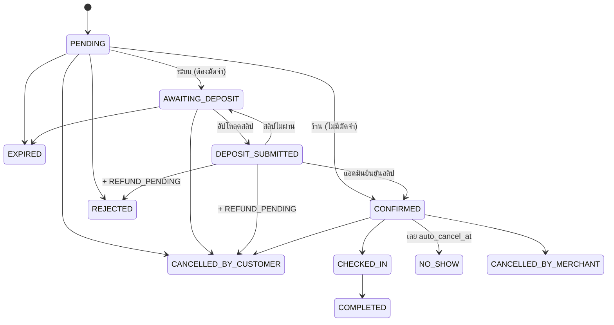

# NightOut — Database Design

> สถานะ: **v1.1** (ทำตาม [`DATABASE_CHANGES.md`](DATABASE_CHANGES.md)) · ใช้คู่กับ [`ARCHITECTURE.md`](ARCHITECTURE.md) และ [`SITEMAP.md`](SITEMAP.md)
> Migration: `apps/backend/supabase/migrations/20261002000100_*.sql` … `20261002001500_*.sql` (15 ไฟล์ แยกตามโดเมน)
> Seed: `apps/backend/supabase/seed.sql` (master data + ร้านเดโม 16 ร้าน — สร้างด้วย `db:seed:gen`)
> Types: `packages/types/src/database.generated.ts` (จาก `supabase gen types` — ห้ามแก้มือ) + `database.ts` (override ของ view) → `import { Db } from '@nightout/types'`
> migration ทีมรุ่นแรก (0001–0003) เก็บไว้อ้างอิงที่ `docs/legacy-migrations/`

---

## 1. หลักการ

| # | หลักการ | ทำอย่างไร |
|---|---|---|
| 1 | ตัวตนผู้ใช้ = `auth.users.id` | `users.id` FK → `auth.users` · เบอร์โทรไม่ใช่ key (`users.phone_e164` ยังไม่บังคับ ใช้เมื่อเปิด OTP) |
| 2 | ชื่อคอลัมน์เต็ม ไม่ย่อ | `grace_minutes`, `min_advance_minutes`, `max_advance_days` … |
| 3 | enum ตัวพิมพ์ใหญ่ทั้งหมด | รวม `pr_gender` = MALE / FEMALE / LGBTQ · `fee_calc` = PERCENTAGE / FIXED_PER_TABLE / FIXED_PER_PERSON |
| 4 | key ที่หน้าบ้านได้รับ = ชื่อหลังบ้าน (snake_case) | ไม่มีชั้นแปลงชื่อ · ข้อยกเว้นเดียว: key ใน `pr_counts` เป็นตัวเล็ก |
| 5 | อ่านผ่าน view/RPC ตรง · เขียนผ่าน NestJS เท่านั้น | RLS มีแค่ `SELECT` · `revoke insert/update/delete` จาก `anon`, `authenticated` ทุกตาราง |
| 6 | หนึ่งหน้า = หนึ่งการเรียก | view 7 ตัว + RPC 2 ตัว ในหัวข้อ 5 · ใช้กฎ "ไม่มีข้อมูล" |
| 7 | กฎสำคัญอยู่ใน DB | exclusion constraint, composite FK, trigger transition, unique กันซ้ำ |
| 8 | snapshot สิ่งที่ลูกค้าเห็นตอนจอง | ราคา / แพ็กเกจ / โปร / มัดจำ / grace |
| 9 | PDPA | ไม่เก็บพิกัดผู้ใช้, IP เป็น hash, เลขบัญชีเข้ารหัส, สลิป/เบอร์ลบตาม retention, job anonymize บัญชีที่ลบ |

**กฎตาราง:** ตารางหลักมี `id`, `created_at`, `updated_at` + trigger `set_updated_at` · ข้อยกเว้น: ตารางเชื่อม PK คู่ (`bar_styles`, `favorites`) และตาราง log `bigint identity` (`audit_logs`, `job_runs`, `booking_status_history`, `crowd_status_logs`, `review_moderation_logs`) · ตาราง 1:1 (`user_preferences`, `bar_booking_settings`, `bar_stats`, `bar_live_status`) ใช้ FK เป็น PK

---

## 2. Migration (แยกตามโดเมน)

| ไฟล์ | เฟส | เนื้อหา |
|---|---|---|
| `…000100_extensions_enums` | 1 | extensions (pgcrypto, btree_gist, citext, pg_trgm, **postgis**, pg_cron, pg_net → schema `extensions`) · enums · `set_updated_at()` |
| `…000200_users_notifications` | 1 | users, legal_documents, user_consents, user_preferences, notification_channels, notifications, notification_deliveries, audit_logs, job_runs · trigger สมัครสมาชิก |
| `…000300_master_data` | 1 | districts, styles, safety_features, platform_settings (ข้อมูลอยู่ใน seed) |
| `…000400_bars` | 1 | bars + **bar_booking_settings / bar_stats / bar_live_status** (1:1) + **bar_pr_counts** + bar_staff, hours, special_hours, styles, media, links, verifications, payout_accounts, safety_features · helper RLS |
| `…000500_menu_pricing` | 1 | menu_categories, menu_items, bar_fees, price_packages, price_package_items, bar_promotions |
| `…000600_tables_bookings` | 1 | table_zones, tables, bookings (+ composite FK, exclusion), status history, snapshots, booking_promotions, qr_tokens, checkins · transition · `zone_remaining_pax` |
| `…000700_reviews_favorites` | 1 | reviews, review_media, review_reports, review_moderation_logs, favorites |
| `…000800_views_rls_storage` | 1 | **view 7 ตัว + search_bars / nearby_bars** · RLS · สิทธิ์คอลัมน์ · Storage 6 buckets · Realtime |
| `…000900_deposits_payouts` | 2 | deposits, bar_payouts, bar_credit_ledger — **DRAFT** (รอข้อ 10.3) · คืนเงินอัตโนมัติเมื่อยกเลิกระหว่างรอตรวจสลิป |
| `…001000_sharing_safety_crowd` | 2 | booking_shares, booking_share_joins, `get_share_card`, safety_reports, crowd_status_logs → `bar_live_status` |
| `…001100_ranking` | 2 | tier_scores, editor_picks |
| `…001200_promoted_listings` | 2 | promotion_packages, promoted_listings, payments, stats · `bar_is_promoted()` ตัวจริง |
| `…001300_billing` | 2 | commission_rules, invoices, billing_events |
| `…001400_retention_jobs` | 2 | `run_retention_jobs()` (PDPA) + วิธีตั้ง pg_cron |
| `…001500_fk_indexes_final` | — | index บน FK ทุกตัว (63 ตัว สร้างจาก catalog) · เปิด RLS · revoke write |
| `…001600_admin` | Backoffice | `is_admin()` (ADMIN + MFA aal2) · policy `admin_read` ทุกตาราง · view `admin_*` 9 ตัว · `rpc('admin_dashboard')` · ฟังก์ชันการกระทำ `admin_*` 8 ตัว (service_role เท่านั้น + audit log) |
| `…001700_app_actions` | แอปจริง | ฟังก์ชันการกระทำของลูกค้า/ร้าน `app_*` 26 ตัว (service_role เท่านั้น เรียกผ่าน NestJS) · trigger ผลของสถานะการจอง (มัดจำ → รอโอน/รอคืน, เช็กอิน, ค่าคอม, แจ้งเตือน) · `run_booking_timeouts()` · view `my_bar_detail` / `my_reviews` / `admin_bar_promotions` · RPC `zone_availability`, `bar_deposit_ledger`, `bar_team`, `my_invites` · `booking_detail` เพิ่ม `customer_name, share_token, has_review` |
| `…20261003000200_admin_create_user` | Backoffice เพิ่มผู้ใช้ | ฟังก์ชัน `admin_finish_new_user` (ตั้ง role + ผูกร้าน + audit · service_role) |
| `…20261003000100_admin_team_members` | Backoffice จัดการทีมงาน | view `admin_team_members` · policy `admin_read` บน team_members · ฟังก์ชัน `admin_save/delete/reorder_team_member(s)` (service_role) · bucket `team-photos` (public · เขียนได้เฉพาะแอดมิน + MFA) |
| `…20261006000100_slip_reject_reasons_fake_slip_ban` | กันสลิปปลอม | `deposits.reject_code` (FAKE_SLIP · AMOUNT_MISMATCH · WRONG_ACCOUNT · UNREADABLE · DUPLICATE · OTHER) · `users.banned_at/ban_reason` · ตาราง **user_flags** (ธงสลิปปลอม, เก็บเบอร์ในแถว) · **banned_phones** · `admin_review_deposit(…, p_reason_code)` ติดธง → ครบ 2 ครั้ง (นับทั้งบัญชีและเบอร์) แบนบัญชี + ทุกเบอร์ที่บัญชีเคยใช้ · `admin_unban_user` (ปลด + ล้างธง) · `booking_ban_check` ใช้ตอนจอง/ส่งสลิป · แก้บั๊ก: ลูกค้ายกเลิกระหว่างรอตรวจ แล้วแอดมินอนุมัติ → คง `REFUND_PENDING` (เดิมทับเป็น HELD) / ปฏิเสธ → `NONE` (เดิมชน CHECK) |
| `…20261006000200_checkout_deposit_consent` | Checkout | ตาราง **booking_deposit_consents** (หลักฐานการติ๊กยอมรับเงื่อนไขริบมัดจำ: ข้อความที่เห็น + เวอร์ชัน + ค่ามัดจำ/ชั่วโมงคืนเงิน/grace/นโยบายร้าน ณ ตอนนั้น + IP + User-Agent + เวลา · trigger ห้าม update/delete) · `app_create_booking` ตัวใหม่ (`p_contact_phone`, `p_consent`) = ตรวจแบน → `app_create_booking_core` (ตัวเดิม) → บันทึกเบอร์ + consent ในธุรกรรมเดียว · จำเบอร์ไว้ที่ `users.phone_e164` · `admin_bookings` + `contact_phone` (ผ่าน `admin_booking_contact_phone()` เพราะคอลัมน์นี้ไม่ได้ grant ให้ authenticated) + `deposit_consent` |
| `…20261006000300_merchant_move_table_refund` | Dashboard ร้าน | `app_team_move_booking` (ย้ายโซน/โต๊ะ ช่วงเวลาเดิม · ทีมร้านทุกบทบาท) · `bar_booking_table_options(booking)` (โต๊ะว่างให้เลือก) · `app_team_refund_deposit` (ร้านอนุมัติคืนมัดจำ → `REFUND_PENDING` + `deposits.refund_reason/requested_by/requested_at`) · `booking_deposit_summary` เป็น security definer (ทีมร้านเห็นสถานะมัดจำใน `booking_detail` ได้ — ไม่มี path สลิป) · `admin_deposits` + เหตุผลคืนเงิน |
| `…001800_team_members` | หน้า /about | team_members (ทีมงาน: ชื่อเล่น, ชื่อจริง, ตำแหน่ง, bio, สกิล, รูป, `contacts` jsonb) · view `public_team` (เฉพาะ active เรียง sort_order) · RLS อ่านได้เฉพาะ active · revoke write · ทีมตั้งต้น 7 คน |

view ในเฟส 1 เรียกฟังก์ชัน stub (`bar_is_promoted`, `booking_deposit_summary`) ที่เฟส 2 แทนที่ → เฟส 1 ใช้งานได้เองโดยไม่พึ่งตารางเฟส 2

**รวม:** 64 ตาราง · 21 view (7 หน้าบ้าน + `public_team` + `my_bar_detail` + `my_reviews` + `bar_credit_balance` + 10 Backoffice) · RLS เปิดครบ · FK ทุกตัวมี index

---

## 3. โครงสร้างที่เปลี่ยนใน v1.1

### 3.1 ร้าน = `bars` + ตาราง 1:1 (สร้างอัตโนมัติด้วย trigger ตอน insert ร้าน)

| ตาราง | คอลัมน์ |
|---|---|
| `bars` | id, owner_id (null ได้), slug, name, category, description, address, district_id (null ได้), lat, lng, **location** (geography generated), phone, cover_image_url, cover_style, perks, status, status_reason, approved_at, trial_ends_at |
| `bar_booking_settings` | deposit_amount, deposit_unit, deposit_policy, refund_before_hours, **grace_minutes**, pending_timeout_minutes, deposit_timeout_minutes, max_pax_per_booking, **min_advance_minutes**, **max_advance_days** |
| `bar_stats` | avg_price_per_person, safety_score, score, current_stars, current_tier, is_new, rating_avg, rating_count, checkin_count, is_editor_pick (ตัวนับเริ่ม 0 · ค่าเฉลี่ย/ดาว เริ่ม null) |
| `bar_live_status` | current_crowd (**null = ยังไม่เคยอัปเดต**), crowd_updated_at · **ตารางเดียวที่เปิด Realtime** |
| `bar_pr_counts` | PK (bar_id, gender) · pr_count ≥ 1 · **ไม่มีแถว = ไม่มี PR** |

`owner_id` ถูกเพิ่มเป็น `bar_staff` role OWNER อัตโนมัติ · สิทธิ์ระดับร้านอิง `bar_staff` เท่านั้น (`is_bar_member()`)

### 3.2 แผนที่
`bars.location geography(Point,4326)` generated จาก lng/lat + GiST index · `nearby_bars(p_lat, p_lng, p_radius_m)` ใช้ `ST_DWithin` / `ST_Distance` (รัศมี 100 ม.–50 กม., สูงสุด 200 ร้าน)

### 3.3 Composite FK
- `bookings (zone_id, bar_id)` → `table_zones (id, bar_id)` — โซนต้องเป็นของร้านนั้น
- `bookings (table_id, zone_id)` → `tables (id, zone_id)` — โต๊ะต้องอยู่ในโซนนั้น
- `reviews (booking_id, bar_id)` → `bookings (id, bar_id)` · `deposits` และ `billing_events` ใช้แบบเดียวกัน

### 3.4 คอลัมน์ใหม่
`bookings.contact_phone` (E.164, ร้านเห็นผ่าน NestJS เฉพาะ CONFIRMED + consent, ล้างตาม retention) · `bookings.request_pr pr_gender` · `checkins.actual_spend` · `users.phone_e164` + `phone_verified_at` (partial unique) · `users.anonymized_at` · `price_package_items.sort_order`, `bar_promotions.sort_order`

### 3.5 มัดจำ (4.4)
`settlement <> 'NONE'` ได้เฉพาะ `status = 'VERIFIED'` **ยกเว้น** `REFUND_PENDING` ตอน `SUBMITTED` · trigger: booking `DEPOSIT_SUBMITTED → CANCELLED_BY_CUSTOMER / REJECTED` → มัดจำที่รอตรวจเป็น `REFUND_PENDING` อัตโนมัติ

---

## 4. Booking state machine

`booking_transition_allowed()` ใน DB = `Db.BOOKING_TRANSITIONS` ใน `packages/types` (ตรวจแล้ว ข้อ 7.4)

---

## 5. สัญญา view / RPC สำหรับหน้าบ้าน

ทุก view `security_invoker = true` (ใช้ RLS ของผู้เรียก) · ตารางเบื้องหลังมี policy `SELECT` ให้ anon อ่านข้อมูลสาธารณะ

| view / RPC | ใช้ที่ | ผู้เรียก | type |
|---|---|---|---|
| `bar_cards` | ลิสต์ร้าน, แผนที่, ranking | anon + authenticated | `Db.BarCard` |
| `bar_detail` | หน้าร้าน (รวมเมนู/เซ็ต/โปร/โซน-โต๊ะ/ค่าธรรมเนียม/ความปลอดภัย/ตั้งค่าการจอง) | anon + authenticated | `Db.BarDetail` |
| `public_reviews` | รีวิวในหน้าร้าน (rating, comment, created_at, display_name, media) | anon + authenticated | `Db.PublicReview` |
| `my_bars` | ร้านที่ฉันอยู่ในทีม (ทุกสถานะ + staff_role) | authenticated | `Db.MyBar` |
| `my_bookings` | รายการจองของฉัน | authenticated | `Db.MyBooking` |
| `booking_detail` | รายละเอียดการจอง (ลูกค้า/ทีมร้าน · ไม่มี contact_phone · deposit ไม่มี slip_path) | authenticated | `Db.BookingDetail` |
| `my_favorites` | ร้านโปรด (bar_cards + favorited_at) | authenticated | `Db.MyFavorite` |
| `public_team` | ทีมงานหน้า `/about` (nickname, full_name, roles, bio, skills, photo_url, contacts, sort_order) · เฉพาะ active เรียง sort_order | anon + authenticated | `Db.PublicTeamMember` |
| `rpc('search_bars', {p_keyword, p_district_id, p_category, p_style_ids, p_pr_gender, p_limit, p_offset})` | ค้นหา · แบ่งหน้า (limit ≤ 100) · เรียง โปรโมท → คะแนน | anon + authenticated | `Db.BarCard[]` |
| `rpc('nearby_bars', {p_lat, p_lng, p_radius_m})` | ใกล้ฉัน · เรียงตามระยะ | anon + authenticated | `Db.NearbyBar[]` |

**กฎ "ไม่มีข้อมูล" (เทสต์แล้วกับร้านว่างที่สุด):** array = `[]` · object = `null` · ตัวนับ = `0` · ค่าเฉลี่ย/ข้อความ/วันที่/enum = `null` · `pr_counts` = `{male:0,female:0,lgbtq:0}` · ทุก key อยู่เสมอ · array มี `ORDER BY` เสมอ · เวลา `"HH:MM"` · `styles` เป็น key ตัวใหญ่ (`"ROOFTOP"`) · `safety` แสดงทุกข้อ (ไม่มีข้อมูล = `UNKNOWN`)

**หน้าบ้าน:** ส่ง `request_pr` / `p_pr_gender` เป็นตัวใหญ่ (`Db.PR_GENDER_KEYS.female` → `'FEMALE'`) · เช็กอายุ 20+ ก่อน `signUp()` (error จาก trigger เหลือแค่ "Database error saving new user")

### 5.1 Backoffice (`…001600_admin`)

**อ่าน** — หน้าแอดมินอ่าน view ผ่าน `GET /api/admin/views/:view` (ADR 0003 — backend อ่านในนามแอดมิน) · ทุก view มี `where public.is_admin()` → คนที่ไม่ใช่ ADMIN หรือยังไม่ผ่าน MFA (aal1) ได้แถวว่าง · anon อ่านไม่ได้เลย

| view / RPC | หน้า | type |
|---|---|---|
| `rpc('admin_dashboard')` | แดชบอร์ด (จองวันนี้, ร้านรออนุมัติ, สลิปมัดจำ/โปรโมทรอตรวจ, รอโอนให้ร้าน, รีวิวถูกรายงาน) | `Db.AdminDashboard` |
| `admin_users` | ผู้ใช้ + ร้านที่อยู่ในทีม | `Db.AdminUser` |
| `admin_bars` | ร้านรออนุมัติ · จัดการร้าน · ดาว/อันดับ (ทุกสถานะ + ย่าน + เจ้าของ + สถิติ) | `Db.AdminBar` |
| `admin_bookings` | การจอง + ประวัติสถานะ (ชื่อผู้เปลี่ยน) | `Db.AdminBooking` |
| `admin_deposits` | มัดจำ + การจอง + บัญชีร้าน (เลขท้าย 4 ตัว) | `Db.AdminDeposit` |
| `admin_reviews` | รีวิว + รายงาน | `Db.AdminReview` |
| `admin_safety_queue` | มาตรการ Safety + จำนวนรายงานว่าไม่จริง | `Db.AdminSafetyItem` |
| `admin_promoted_listings` | โปรโมท + แพ็กเกจ + สลิปล่าสุด | `Db.AdminPromotedListing` |
| `admin_billing_events` | ค่าคอม | `Db.AdminBillingEvent` |
| `admin_audit_logs` | Audit log + ผู้ทำ | `Db.AdminAuditLog` |
| `admin_team_members` (`…20261003000100`) | จัดการทีมงาน — ทีมงานหน้า /about ทุกคน (รวมที่ซ่อน) | `Db.AdminTeamMember` |

**เขียน** — ผ่าน NestJS `/api/admin/*` เท่านั้น (guard: token Supabase + `users.role = ADMIN` + `aal2`) → เรียกฟังก์ชัน `admin_*` ด้วย service_role · ฟังก์ชันตรวจ ADMIN ซ้ำ (`admin_assert`) และเขียน `audit_logs` ในธุรกรรมเดียวกัน · หน้าเว็บเรียกฟังก์ชันเหล่านี้ตรงไม่ได้

| endpoint | ฟังก์ชัน | ผล |
|---|---|---|
| `PATCH bars/:id/status` `{status, reason?}` | `admin_set_bar_status` | อนุมัติ / ไม่อนุมัติ / ระงับ / เปิดใช้งาน |
| `PATCH bars/:id/editor-pick` `{value}` | `admin_set_editor_pick` | Editor's Pick |
| `POST safety/:id/verify` | `admin_verify_safety` | → ADMIN_VERIFIED + ปิดรายงาน + คำนวณคะแนน Safety ใหม่ |
| `POST deposits/:id/review` `{approve, reason_code?, reason?}` | `admin_review_deposit` | ผ่าน → VERIFIED/HELD + การจอง CONFIRMED (ลูกค้ายกเลิกไปแล้ว → VERIFIED/REFUND_PENDING) · ไม่ผ่าน (ต้องมี `reason_code`, OTHER ต้องมี `reason`) → REJECTED + การจองกลับ AWAITING_DEPOSIT · `FAKE_SLIP` ติดธง → ครบ 2 แบนบัญชี + เบอร์ (`banned` ในผลลัพธ์) |
| `POST users/:id/unban` `{reason?}` | `admin_unban_user` | ปลดแบนบัญชี + เบอร์ที่โดนเพราะบัญชีนี้ + ล้างธงสลิปปลอม |
| `POST deposits/:id/settle` `{how: PAID_OUT\|CREDIT\|REFUNDED}` | `admin_settle_deposit` | ปิดยอด (CREDIT ลง `bar_credit_ledger`) |
| `POST reviews/:id/moderate` `{action: KEEP\|HIDE\|REMOVE\|RESTORE, reason?}` | `admin_moderate_review` | + `review_moderation_logs` |
| `POST promotions/:id/review` `{approve, reason?}` | `admin_review_promotion` | ผ่าน → ACTIVE |
| `POST users` `{email, display_name, account_type, bar_id?, birthdate, password?}` | Supabase Auth admin (สร้างบัญชี ยืนยันอีเมลแล้ว) → `admin_finish_new_user` (`…20261003000200`) | เพิ่มผู้ใช้: ลูกค้า / แอดมิน / เจ้าของ (MERCHANT + OWNER) / ผู้จัดการ (MERCHANT + MANAGER) / พนักงาน (STAFF) · อีเมลซ้ำ → 409 `EMAIL_EXISTS` · ขั้นที่ 2 พลาด = ลบบัญชีทิ้ง · ไม่ใส่รหัส = สุ่มแล้วตอบกลับครั้งเดียว |
| `PATCH users/:id/role` `{role}` | `admin_set_user_role` | ลดสิทธิ์ตัวเองไม่ได้ |
| `POST team-members` `{nickname, full_name?, roles, bio?, skills, photo_url?, contacts, active}` | `admin_save_team_member` (p_id = null) | เพิ่มทีมงาน (ต่อท้ายลำดับ) |
| `PATCH team-members/:id` (ส่งเฉพาะ field ที่แก้) | `admin_save_team_member` | แก้ / ซ่อน-แสดง (`active`) · audit เก็บก่อน/หลัง |
| `DELETE team-members/:id` | `admin_delete_team_member` | ลบถาวร |
| `PUT team-members/order` `{ids}` | `admin_reorder_team_members` | เรียงใหม่ → sort_order 10, 20, 30 … |

error เป็นรหัส (`NOT_ADMIN`, `MFA_REQUIRED`, `*_NOT_FOUND` → 404, `DEPOSIT_ALREADY_REVIEWED` / `CANNOT_DEMOTE_SELF` ฯลฯ → 409) · หน้าแอดมินแปลเป็นภาษาไทยใน `apps/admin/src/services/api.ts`

### 5.2 แอปลูกค้า / ร้าน (`…001700_app_actions`)

**อ่าน** — หน้าบ้านอ่านผ่าน API (`GET /api/public/catalog`, `/api/me/overview` — ADR 0002 · backend อ่านในนามผู้เรียก RLS คุม) ใน `apps/frontend/src/services/sync.ts` แล้วใส่ store ของ `@nightout/mock` (ใช้เป็น cache) → หน้าเว็บเรียก `listBars()`, `myBookings()`, `barReviews()` … ได้เหมือนเดิม

| ตอนไหน | อ่านอะไร |
|---|---|
| เปิดเว็บ (ก่อน render) | `bar_detail`, `public_reviews` (+ signed URL ของรูปรีวิว), `districts`, `styles`, `platform_settings` (PromptPay), `promotion_packages` |
| หลังล็อกอิน + ทุก 60 วินาที | `booking_detail` (ของฉัน + ของร้านที่อยู่ในทีม), `notifications`, `my_favorites`, `my_reviews`, `user_preferences`, `my_bar_detail` (ร้านของฉันทุกสถานะ), `review_reports`, `promoted_listings` |
| ตามหน้า (TanStack Query) | `rpc('zone_availability')` หน้าจอง · `rpc('bar_team')` / `rpc('my_invites')` พนักงาน · `rpc('bar_deposit_ledger')` มัดจำของร้าน (ไม่มี path สลิป) · `billing_events` ค่าคอม · `rpc('get_share_card')` |

**เขียน** — `apps/frontend/src/services/actions.ts` → NestJS (ตรวจ JWT ได้ `user.id`) → `rpc('app_*', { p_actor: user.id, … })` ด้วย service_role → ฟังก์ชันตรวจสิทธิ์ซ้ำใน DB (`app_assert_user`, `app_assert_manager`, `app_team_role`) → หน้าเว็บโหลดข้อมูลใหม่

| endpoint | ฟังก์ชัน |
|---|---|
| `POST bookings` `{…, contact_phone, deposit_terms}` | `app_create_booking` (ตรวจแบนบัญชี/เบอร์ → จำนวนคน/ล่วงหน้า/ที่ว่างโซน/โปร · มีมัดจำ → ต้องยอมรับเงื่อนไขริบมัดจำ (เก็บ `booking_deposit_consents`) → `AWAITING_DEPOSIT`) |
| `POST bookings/:id/deposit` `{slip_path}` | `app_submit_deposit` (สลิปอยู่ `deposit-slips/<uid>/…`) |
| `POST bookings/:id/cancel` · `POST bookings/:id/review` · `POST reviews/:id/report` | `app_cancel_booking` · `app_add_review` (รูป/วิดีโอใน `review-media/<uid>/<review_id>/…`) · `app_report_review` |
| `POST me/favorites/:barId/toggle` · `POST me/notifications/read` · `PATCH me/profile` · `POST me/delete` | `app_toggle_favorite` · `app_mark_notifications_read` · `app_update_profile` · `app_delete_account` (+ ban ใน Auth) |
| `POST invites/:barId/respond` · `POST merchant/join` | `app_respond_invite` · `app_merchant_join` (ร้าน `PENDING_REVIEW`) |
| `POST merchant/bookings/:id/status` · `POST merchant/bars/:id/check-in` · `…/crowd` | `app_team_set_booking_status` · `app_check_in` (รหัสจองหรือ QR) · `app_set_crowd` |
| `POST merchant/bookings/:id/move` `{zone_id, table_id?, reason?}` · `GET merchant/bars/:barId/bookings/:id/table-options` | `app_team_move_booking` (ทีมร้านทุกบทบาท · โต๊ะไม่ว่าง → `TABLE_TAKEN`) · `rpc('bar_booking_table_options')` |
| `POST merchant/bookings/:id/refund` `{reason}` | `app_team_refund_deposit` (ทีมร้านทุกบทบาท · มัดจำที่ตรวจแล้วและยังไม่โอนให้ร้าน → `REFUND_PENDING` · การจองที่ยังไม่เช็กอินถูกยกเลิกฝั่งร้าน) |
| `PATCH …/info` · `PUT …/menu` · `PUT …/promotions` · `PUT …/fees` · `PUT …/zones` | `app_update_bar_info` · `app_set_menu` · `app_set_bar_promotions` (โปรใหม่/แก้ข้อความ → รอแอดมินตรวจ) · `app_set_fees` · `app_set_zones` |
| `PUT …/safety/:key` · `PUT …/safety/:key/evidence` | `app_set_safety` · `app_set_safety_evidence` (ไฟล์ `bar-verifications/<bar_id>/…`) |
| `PATCH …/booking-settings` · `PUT …/payout-account` | `app_update_booking_settings` (มัดจำ, grace, PR ชาย/หญิง/LGBTQ+) · `app_set_payout_account` (NestJS เข้ารหัส AES-256-GCM ด้วย `PAYOUT_ENCRYPTION_KEY`) |
| `POST …/promotion-orders` · `POST …/staff` · `DELETE …/staff/:userId` | `app_order_promotion` (สลิป `promo-slips/<bar_id>/…`) · `app_invite_staff` · `app_remove_staff` |
| แอดมิน `POST bar-promotions/:id/moderate` | `admin_moderate_bar_promotion` |
| `POST jobs/booking-timeouts` (pg_cron) | `run_booking_timeouts()` — เครื่อง dev รันเองทุก 60 วิ (`LocalJobsScheduler`) |

error เป็นรหัสตัวใหญ่ (`ZONE_FULL`, `NOT_BAR_MANAGER`, `HAS_ACTIVE_BOOKINGS` …) → NestJS แปลง HTTP (P0002→404, P0001/23505/23P01→409, 42501→403, 22023→400) · หน้าเว็บแปลไทยใน `apps/frontend/src/services/api.ts` (`ERROR_TH`)

**ผลของสถานะการจอง** (trigger `handle_booking_status_effects`): เช็กอิน/ไม่มา → มัดจำ `HELD → PAYOUT_PENDING` · ร้านยกเลิก/ปฏิเสธ → `REFUND_PENDING` · ลูกค้ายกเลิกก่อนเวลาคืนเงิน → `REFUND_PENDING` ไม่งั้น `PAYOUT_PENDING` · เช็กอิน → `checkin_count` + ค่าคอม (`billing_events`, ค่าเริ่มต้น 10% ของ avg_price × คน, ไม่มา = WAIVED) · แจ้งเตือนลูกค้าทุกครั้ง · **การโอนเงินจริงยังเป็น DRAFT (ข้อ 10.3)**

---

## 6. ความปลอดภัย

- ฟังก์ชัน `SECURITY DEFINER` ทุกตัว `set search_path = ''` และอ้าง schema เต็ม
- สมัครสมาชิก: `role = 'CUSTOMER'` เสมอ (ไม่อ่าน role จาก `raw_user_meta_data` — เทสต์แล้วส่ง `"role":"ADMIN"` มาก็ยังได้ CUSTOMER) · RLS ไม่อิง `user_metadata`
- สิทธิ์คอลัมน์: `bookings.contact_phone` และ `bar_payout_accounts.account_no_enc` อ่านผ่าน API ตรงไม่ได้
- เลขบัญชีร้าน: **เข้ารหัสฝั่ง NestJS (AES-256-GCM, key จาก env/KMS)** เก็บใน `account_no_enc bytea` (ข้อ 6.6 — เลือกทางนี้เป็นค่าเริ่มต้น ถ้าจะใช้ Supabase Vault ต้องแก้)
- Realtime: publication `supabase_realtime` มีแค่ `bar_live_status`

**Storage** (path `<bucket>/<โฟลเดอร์เจ้าของ>/<ไฟล์>`)

| bucket | อ่าน | เขียน |
|---|---|---|
| `bar-media` (public) | ทุกคน | ทีมร้าน (`<bar_id>/…`) |
| `review-media` (private) | ไฟล์ของรีวิว PUBLISHED ของร้าน APPROVED + เจ้าของ | เจ้าของรีวิว (`<user_id>/<review_id>/…`) |
| `deposit-slips` | ลูกค้าเจ้าของ + แอดมิน · **ร้านห้ามอ่าน** | ลูกค้า (`<user_id>/…`) |
| `bar-verifications` | ทีมร้าน + แอดมิน | ทีมร้าน |
| `payout-slips` | ทีมร้าน + แอดมิน | แอดมิน (NestJS) |
| `promo-slips` | ทีมร้าน + แอดมิน | ทีมร้าน |

`review-media` เป็น private เพื่อให้ไฟล์ของรีวิวที่ถูกซ่อนหยุดแสดงทันที → หน้าบ้านเปิดไฟล์ด้วย `createSignedUrl()` / `download()`

---

## 7. Seed · Job

- `seed.sql`: districts 10, styles 9, safety_features **9 ข้อ** (weight รวม 100), platform_settings (PromptPay, retention), legal_documents (Terms / Privacy / Cookie / Age v1 `is_current`), promotion_packages 5 แบบ + ร้านเดโม 16 ร้านจาก `@nightout/mock`
- ตัวรัน job (ข้อ 8.2): **pg_cron เรียก NestJS `/api/jobs/*` ผ่าน pg_net** (ทุกนาที: no-show, expire, complete, แจ้งเตือน) — คำสั่งตั้งเวลาอยู่ในหัวไฟล์ `…001400_retention_jobs.sql` (ต้องตั้ง secret ใน Vault ก่อน)
- `run_retention_jobs()` (รันวันละครั้ง): anonymize บัญชีที่ `deleted_at` เลย `account_retention_days` (30) + ล้าง `contact_phone` ที่เลย `contact_phone_retention_days` (90) · บันทึกใน `job_runs` · บัญชีใน `auth.users` ให้ NestJS ปิด/เปลี่ยนอีเมลผ่าน Admin API (ห้ามลบ เพราะการจองยังอ้างถึง)

---

## 8. ผลเทสต์ (PostgreSQL 16 + PostGIS 3 + PostgREST 12, role anon/authenticated จริง, JWT จริง)

| หัวข้อ | ผล |
|---|---|
| migration 16 ไฟล์ + seed บน DB เปล่า | ✅ |
| 9.1 view 7 ตัว + RPC 2 ตัว ด้วย anon / authenticated | ✅ 20 เคส (anon อ่าน view ส่วนตัวไม่ได้, search แบ่งหน้าไม่ซ้ำ, nearby เรียงตามระยะ) |
| 9.2 RLS | ✅ 12 เคส — anon อ่านการจอง/ผู้ใช้ไม่ได้ · B อ่านการจองของ A ไม่ได้ · อ่าน contact_phone ผ่าน API ไม่ได้ (ทั้งลูกค้าและร้าน) · ร้านอ่านสลิปไม่ได้ (ทั้งตารางและ Storage) · ลูกค้าแก้สถานะเอง/สร้างร้านเองไม่ได้ · public_reviews ไม่มี email/birthdate |
| 9.3 ร้านว่างที่สุด | ✅ key ครบเท่าร้านข้อมูลเต็ม, array `[]`, ตัวนับ 0, pr_counts 0 ×3, has_pr false, ที่เหลือ null, ไม่มี `""`/`"-"`/`{}` |
| 9.4 PR เพศเดียว | ✅ `{male:0, female:5, lgbtq:0}` |
| 9.5 กฎเดิม | ✅ จองโต๊ะซ้อน · โซน/โต๊ะไม่ตรงร้าน (composite FK) · ข้ามขั้นสถานะ · สลิปซ้ำ · settlement ก่อนตรวจสลิป · รีวิวก่อนเช็กอิน · รีวิวผิดร้าน · ค่าคอมทับกัน · ดาว/tier ไม่ตรง · อายุ < 20 → ถูกปฏิเสธทั้งหมด · ยกเลิกระหว่างรอตรวจ → REFUND_PENDING |
| 9.6 จองโซนพร้อมกัน | ✅ 2 request (6 + 6 คน, ความจุ 10) → request ที่สองรอ lock แล้วได้ FULL (เหลือ 4) |
| แอปลูกค้า/ร้าน (`001700`) | ✅ 84 เคสที่ DB + 36 เคส e2e ของ NestJS + 38 เคสในเบราว์เซอร์จริง (สมัคร→จอง→ส่งสลิป→แอดมินอนุมัติ→ร้านเช็กอิน→รีวิวพร้อมรูป, ทุกหน้าร้าน) |
| Backoffice | ✅ 38 เคสที่ DB (อ่านได้เฉพาะ ADMIN+aal2 · aal1/ลูกค้า/anon ได้แถวว่าง · ฟังก์ชันการกระทำเรียกได้เฉพาะ service_role · ทุกการกระทำมี audit) + 16 เคส e2e ของ NestJS `/api/admin/*` (401 ไม่มี token · 403 MFA_REQUIRED / NOT_ADMIN · 400 body/uuid ผิด · 404 · 409) |
| 9.7 types | ✅ `database.generated.ts` จาก `supabase gen types` + override view ใน `database.ts` (ผ่าน `tsc --strict`) |
| กฎตาราง | ✅ ทุกตารางหลักมี created_at/updated_at + trigger · view ทุกตัว security_invoker · SECURITY DEFINER ทุกตัว search_path '' · enum ตัวใหญ่ทั้งหมด · FK ทุกตัวมี index |

---

## 9. ต่างจาก spec / ต้องตัดสินใจ

| เรื่อง | ทำอย่างไร |
|---|---|
| safety_features **10 ข้อ** (spec 8) | ใช้ **9 ข้อ** ตามที่หน้าเว็บมี label (`SECURITY, CCTV, FIRE_EXIT, FIRST_AID, ID_CHECK, PARKING_RIDE, FEMALE_STAFF, LIGHTING, EMERGENCY_CONTACT`) · เพิ่มข้อที่ 10 = insert แถวใน seed + label ในหน้าเว็บ |
| `bar_detail` มี key มากกว่าตัวอย่าง 5.4 | เพิ่ม special_hours, booking_settings, fees, menu, packages, promotions, zones, safety, perks, cover_style, score, is_promoted เพื่อให้หน้าร้าน/หน้าจองเรียกครั้งเดียว |
| ตาราง 1:1 ไม่มี `id` แยก | ใช้ `bar_id` / `user_id` เป็น PK |
| PR เพศ LGBTQ | แสดงในป้าย PR + ร้านกรอกได้ใน `/merchant/settings` |
| การเขียนจากหน้าบ้าน | RLS ปิดทั้งหมด · เขียนผ่าน NestJS → `app_*` (หัวข้อ 5.2) |
| 10.3 ถือเงินมัดจำแทนร้าน | ตาราง deposits/payouts เป็น DRAFT — **ห้ามเปิดรับเงินจริงก่อนได้คำตอบจากที่ปรึกษากฎหมาย** |
| 10.8 โปรแอลกอฮอล์ | ร้านเดโมยังมี "โปรเบียร์ก่อน 2 ทุ่ม" (มาจาก `@nightout/mock`) — รอตัดสินใจ |
| 10.1, 10.2, 10.4–10.7, 10.9 | ยังเลื่อน/รอตัดสินใจตาม spec |
