# NightOut — Sitemap

> สถานะ: **Draft v0.3** · ใช้คู่กับ [`ARCHITECTURE.md`](ARCHITECTURE.md) และ [`STRUCTURE.md`](STRUCTURE.md) (route → โมดูล) · **Figma:** ✅ มีแบบแล้ว · 🟡 มี wireframe · ⬜ ยังไม่มี · 📝 = path ที่วางแผนไว้แต่ยังไม่มีใน `src/router/index.tsx`
>
> **เพิ่ม / ลบ / เปลี่ยน route ต้องแก้ไฟล์นี้ในงานเดียวกัน** (ตาราง + แผนภาพข้อ 1 + Navigation ถ้ากระทบ) คู่กับ [`STRUCTURE.md`](STRUCTURE.md)

## 1. ภาพรวม

```mermaid
flowchart TD
  ROOT(("nightout.app"))
  ROOT --> PUB["สาธารณะ"]
  ROOT --> AUTH["เข้าสู่ระบบ"]
  ROOT --> ME["ลูกค้า (ล็อกอินแล้ว)"]
  ROOT --> MER["ร้าน /merchant"]
  ADMIN(("admin.nightout.app")) --> ADM["Backoffice"]

  PUB --> HOME["/ หน้าแรก"]
  PUB --> RANK["/ranking จัดอันดับ"]
  PUB --> SEARCH["/search ค้นหา"]
  PUB --> BAR["/bars/:slug หน้าร้าน"]
  PUB --> SHARE["/share/:token บัตรจอง"]
  PUB --> MAP["/map แผนที่"]
  PUB --> INFO["/about (+ /contact) · /terms · /privacy · /cookies"]

  AUTH --> LOGIN["/login"]
  AUTH --> REG["/register"]
  AUTH --> FGT["/forgot-password · /reset-password"]
  AUTH --> VER["/verify-email"]
  AUTH --> INV["/accept-invite"]
  AUTH --> ONB["/onboarding"]

  BAR --> BOOK["/bars/:slug/book จอง"]
  BOOK --> DEP["/bookings/:id/deposit มัดจำ"]
  DEP --> DONE["/bookings/:id บัตรจอง + QR"]

  ME --> MYB["/bookings การจองของฉัน"]
  ME --> FAV["/favorites"]
  ME --> MYR["/reviews รีวิวของฉัน · /reviews/new"]
  ME --> NOTI["/notifications"]
  ME --> PROF["/profile · /settings"]
  ME --> JOIN["/merchant/join · /merchant/status"]

  MER --> MD["/merchant แดชบอร์ด"]
  MER --> TON["/merchant/tonight Scanner"]
  MER --> MB["/merchant/bookings · /deposits"]
  MER --> MS["/merchant/store · /menu · /tables · /safety · /promotions · /settings"]
  MER --> MP["/merchant/promote · /reviews · /analytics · /billing · /staff"]

  ADM --> AD["/ แดชบอร์ด"]
  ADM --> AR["/bars · /merchants · /safety · /ranking"]
  ADM --> AB["/billing · /promotions · /deposits · /bookings · /reviews"]
  ADM --> AU["/users · /team · /home-content · /audit-logs · /settings"]
```

**Access:** 🌐 ทุกคน · 👤 ลูกค้าที่ล็อกอิน · 🏪 เจ้าของร้าน · 🧑‍🍳 Staff · 🛡️ Admin

> ทุกหน้าใน `apps/frontend` ต้องผ่าน **Age Gate 20+** ก่อน (แสดงเป็น modal ครั้งแรกที่เข้า) ยกเว้น `/terms`, `/privacy` และ `/cookies`

---

## 2. apps/frontend — ลูกค้า

### สาธารณะ
| Path | หน้า | Access | ส่วนประกอบหลัก | Figma |
|---|---|---|---|---|
| `/` | หน้าแรก | 🌐 | Hero, การ์ดหมวด "คืนนี้อยากได้ฟีลไหน" (bento 8 ช่อง → /search, /ranking · Hero + การ์ดแก้ได้จาก Backoffice `/home-content`), อันดับประจำสัปดาห์ (แบนเนอร์อันดับ 1 + การ์ดอันดับ 2–3), ร้านยอดนิยม (กริด 8 ร้าน + ปุ่มจองโต๊ะ), แบนเนอร์สมัครข่าวสาร | ⬜ (มีภาพ mockup) |
| `/ranking` | จัดอันดับ (รายสัปดาห์ / รายเดือน) | 🌐 | Hero วงล้อการ์ดหมุน (GSAP + scroll), สลับ สัปดาห์/เดือน + ประเภทร้าน (?period=&category=), แท่น 3 อันดับกางเป็นพัดตามการเลื่อน + ตัวเลขโหวตนับขึ้น, อันดับ 4–10 พร้อมป้ายคะแนนรีวิว (Figma "จัดอันดับ") | ✅ |
| `/ranking/:category/:district?` | จัดอันดับตามหมวด/ย่าน (📝 ยังไม่มีใน router) | 🌐 | เหมือนด้านบน (URL แชร์ได้, SEO) | ⬜ |
| `/search` | ค้นหา | 🌐 | ช่องค้นหา, ตัวกรอง (ย่าน/ประเภท/งบ/เวลาว่าง/ความปลอดภัย), ผลแบบ list + แผนที่ | ⬜ |
| `/bars/:slug` | หน้าร้าน | 🌐 | รูป, ดาว (ระดับร้าน), Crowd, PR ชาย/หญิง, โปรโมชัน, แผนที่ + นำทาง, Safety, เมนูราคา (อ้างอิง), รีวิว, ลิงก์โซเชียล, แถบ "ประเมินราคา / จองเลย" | ✅ Card ร้าน |
| `/bars/:slug/reviews` | รีวิวทั้งหมด | 🌐 | รีวิวทั้งหมด, กรอง "มีรูป/วิดีโอ", ปุ่มเขียนรีวิว (เมื่อเช็กอินแล้ว), ดูรูปเต็มจอ / เล่นวิดีโอ | ⬜ |
| `/share/:token` | บัตรจองที่แชร์ | 🌐 | ร้าน, เวลา, โซน, แผนที่, ปุ่ม "ไปด้วย" (ไม่มีข้อมูลส่วนตัว) | ⬜ |
| `*` | 404 | 🌐 | ภาพขวด+แก้วบนบาร์ม่วงเต็มจอ, "PAGE NOT FOUND", 404 ทองตัวใหญ่, ปุ่มกลับหน้าหลัก / ค้นหาร้าน (Figma "404") | ✅ |
| `/about` · `/contact` | เกี่ยวกับเรา · ทีมงาน (โคราเซลหมุน) · ติดต่อเรา — `/contact` เปิดหน้าเดียวกันแล้วเลื่อนไปส่วนติดต่อ | 🌐 | `modules/about/utils/content.ts` | ✅ |
| `/terms` · `/privacy` · `/cookies` | นโยบาย | 🌐 | เนื้อหา | ⬜ |

### เข้าสู่ระบบ
| Path | หน้า | Access | ส่วนประกอบหลัก | Figma |
|---|---|---|---|---|
| `/login` | เข้าสู่ระบบ | 🌐 | อีเมล + password, ลืมรหัสผ่าน, ลิงก์ไปสมัคร, Turnstile | 🟡 Login, Login-P |
| `/register` | สมัครสมาชิก | 🌐 | อีเมล, password + ยืนยัน, ชื่อที่แสดง, วันเกิด (20+), ยอมรับ Terms/Privacy, Turnstile | 🟡 |
| `/verify-email` | ยืนยันอีเมล | 🌐 | แจ้งให้เช็กอีเมล + ส่งใหม่ | ⬜ |
| `/forgot-password` | ลืมรหัสผ่าน | 🌐 | อีเมล | ⬜ |
| `/reset-password` | ตั้งรหัสใหม่ | 🌐 | password + ยืนยัน | ⬜ |
| `/accept-invite` | รับคำเชิญ Staff | 🌐 | ตั้งรหัสผ่านจากลิงก์เชิญทางอีเมล | ⬜ |
| `/onboarding` | ตั้งค่าความชอบ | 👤 | สไตล์ร้าน, งบ, จำนวนคน, ย่าน | ⬜ |

### ลูกค้า (ล็อกอินแล้ว)
| Path | หน้า | Access | ส่วนประกอบหลัก | Figma |
|---|---|---|---|---|
| `/map` | แผนที่ร้าน (เต็มจอ) | 🌐 | หมุดวงกลมรูปร้าน (ขอบสีตามความแน่น, วงทอง = โปรโมท), ตำแหน่งของฉัน, ปุ่มลอย ย้อนกลับ/ค้นหา/ตัวกรอง/ซูม, การ์ดร้าน ดูร้าน/จอง/นำทาง | ⬜ |
| `/bars/:slug/book` | จองโต๊ะ | 👤 | วัน/เวลา/คน/โซน, เลือกโปรโมชันของร้าน (เช็กเวลา/วันให้), สรุป + มัดจำ (ทุกการจอง) · เบอร์โทร (บังคับ จำค่าเดิมให้) · checkbox ยอมรับเงื่อนไขริบมัดจำ (เก็บหลักฐาน) · บัญชีที่ถูกแบนจองไม่ได้ | ⬜ |
| `/bookings` | การจองของฉัน | 👤 | แท็บ กำลังจะถึง / ที่ผ่านมา / ยกเลิก | ⬜ |
| `/bookings/:id` | บัตรจอง | 👤 | สถานะ, QR เช็กอิน, นับถอยหลัง auto-cancel, แชร์ LINE, ยกเลิก | ⬜ |
| `/bookings/:id/deposit` | จ่ายมัดจำ | 👤 | PromptPay QR ของ NightOut (แพลตฟอร์มถือเงิน), นโยบายมัดจำ, อัปโหลดสลิป | ⬜ |
| `/reviews/new?booking=:id` | เขียนรีวิว | 👤 | ดาว, ความเห็น, แนบรูป/วิดีโอ สูงสุด 6 ไฟล์ (วิดีโอ ≤ 60 วิ / 60MB, รูปย่ออัตโนมัติ) | ⬜ |
| `/reviews` | รีวิวของฉัน | 👤 | รายการ + แก้ไข | ⬜ |
| `/favorites` | ร้านโปรด | 👤 | การ์ดร้าน | ⬜ |
| `/notifications` | แจ้งเตือน | 👤 | รายการ + อ่านแล้ว | ⬜ |
| `/profile` | โปรไฟล์ | 👤 | ข้อมูลส่วนตัว, ช่องทางแจ้งเตือน (LINE opt-in) | ⬜ |
| `/settings` | ตั้งค่า | 👤 | ธีม Light/Dark/ระบบ, ลด motion, consent, ลบบัญชี | ⬜ |

---

## 3. apps/frontend — ร้าน (`/merchant`)

| Path | หน้า | Access | ส่วนประกอบหลัก |
|---|---|---|---|
| `/merchant/join` | สมัครเป็นร้าน | 👤 | ข้อมูลร้าน, เอกสาร, ส่งตรวจ |
| `/merchant/status` | สถานะการตรวจ | 🏪 | DRAFT / PENDING_REVIEW / APPROVED / REJECTED |
| `/merchant` | แดชบอร์ด | 🏪 | จองวันนี้, อัตราเช็กอิน / No-show, ดาว, ช่วงทดลองใช้ |
| `/merchant/tonight` | คืนนี้ (Scanner) | 🏪🧑‍🍳 | สแกน QR, รายการจองคืนนี้, ปุ่ม Crowd Status · **Dark เสมอ** |
| `/merchant/bookings` | การจอง | 🏪 | ปฏิทิน / รายการ, ยืนยัน / ปฏิเสธ · รายละเอียด → "จัดการหน้างาน" (ทุกคนในทีมรวม PR): **ย้ายโต๊ะ** (เลือกโต๊ะที่ว่าง) · **ยืนยันการคืนเงิน** (มัดจำเข้าคิวให้ NightOut โอนคืน) |
| `/merchant/bookings/:id` | รายละเอียดการจอง (📝 ยังไม่มีใน router) | 🏪 | ประวัติสถานะ, โปรที่ลูกค้าเลือก, สถานะเงินมัดจำ |
| `/merchant/deposits` | เงินมัดจำ | 🏪 | ยอดที่ NightOut ถือไว้ / รอโอน / โอนแล้ว / เครดิต + รายการ (แอดมินเป็นคนตรวจสลิป) |
| `/merchant/store` | ข้อมูลร้าน | 🏪 | ชื่อ, รูป, เวลาเปิด-ปิด, styles, ลิงก์ |
| `/merchant/safety` | ความปลอดภัย | 🏪 | checklist + อัปโหลดหลักฐาน |
| `/merchant/menu` | เมนู | 🏪 | หมวด, รายการ, รูป, ราคา |
| `/merchant/promotions` | โปรโมชัน | 🏪 | โปรที่ลูกค้าเลือกได้ตอนจอง (เช่น โปรเบียร์ก่อน 2 ทุ่ม: cutoff time, วัน, เปิด/ปิด), ค่าธรรมเนียม SC/VAT |
| `/merchant/tables` | โซน / โต๊ะ | 🏪 | โซน, ความจุ, ระยะเวลาจอง |
| `/merchant/settings` | ตั้งค่าการจอง | 🏪 | ยอดมัดจำ/นโยบาย, บัญชีธนาคารรับเงินจาก NightOut, PR ชาย/หญิง, grace period |
| `/merchant/promote` | โปรโมทร้าน | 🏪 | เลือกแพ็กเกจ, จ่าย, สถานะ, สถิติ |
| `/merchant/reviews` | รีวิว | 🏪 | รายการรีวิว, รายงานรีวิว |
| `/merchant/analytics` | สถิติ | 🏪 | กราฟการจอง, ช่วงเวลายอดนิยม |
| `/merchant/billing` | ค่าคอม | 🏪 | billing events รายเดือน |
| `/merchant/staff` | พนักงาน | 🏪 | เชิญ / ลบ Staff |

---

## 4. apps/admin — Backoffice (`admin.nightout.app`)

| Path | หน้า | ส่วนประกอบหลัก (ProComponents) |
|---|---|---|
| `/login` | เข้าสู่ระบบ (email + password) + TOTP MFA | Form |
| `/` | แดชบอร์ด | ยอดจอง, ร้านใหม่, รายการรอตรวจ |
| `/merchants` | ร้านรออนุมัติ | ProTable + Drawer ตรวจเอกสาร |
| `/bars` · `/bars/:id` | จัดการร้าน (📝 `/bars/:id` ยังไม่มีใน router) | ProTable, ระงับ / เปิด, Editor's Pick |
| `/safety` | ยืนยัน Safety | ProTable + หลักฐาน + รายงานจากลูกค้า |
| `/ranking` | ดาว / อันดับ | คะแนนรายเดือน, ปักหมุด |
| `/promotions` | โปรโมท | แพ็กเกจ, ตรวจสลิป, ช่องว่างต่อย่าน |
| `/deposits` | เงินมัดจำ | ตรวจสลิปที่โอนเข้า NightOut (ไม่ผ่าน = เลือกเหตุผลจาก dropdown · "สลิปปลอม" ติดธง ครบ 2 ครั้งแบนบัญชี + เบอร์), ถือไว้, รอโอนให้ร้าน (โอนแล้ว / เก็บเป็นเครดิต), รอคืนลูกค้า (เหตุผล + คนในร้านที่อนุมัติ), จบแล้ว |
| `/users` | ผู้ใช้ | ProTable, role · เบอร์ · สถานะการจอง (ถูกแบน / ธงสลิปปลอม + ปุ่มปลดแบน) · ปุ่ม "เพิ่มผู้ใช้" (ลูกค้า / แอดมิน / เจ้าของ / ผู้จัดการ / พนักงานร้าน + เลือกร้าน · รหัสสุ่มแสดงครั้งเดียว) |
| `/team` | จัดการทีมงาน | ทีมงานหน้า /about: เพิ่ม/แก้ (Drawer: รูป, ตำแหน่ง, แนะนำตัว, ทักษะ, ช่องทางติดต่อ), ซ่อน/แสดง, ลากเรียงลำดับ (ปุ่มจับซ้ายสุดของแถว · คีย์บอร์ดได้), ลบ · เพิ่ม/ลบ/เรียงลำดับ เฉพาะ Super Admin · Admin แก้/ซ่อนได้เฉพาะแถวที่อีเมลตรงกับบัญชีตัวเอง (ปุ่มของแถวอื่นถูกปิด) |
| `/home-content` | หน้าแรก | แก้ Hero (หัวข้อ 3 ท่อน, คำโปรย, ช่องค้นหา, ภาพพื้น / กลับไปภาพตั้งต้น) + ชื่อ section หมวด · การ์ดหมวด 8 ช่อง (Drawer: ภาพ, ชื่อ, คำอธิบาย, ไอคอน, ลิงก์, ป้าย) · ตำแหน่งบนกริดตายตัว |
| `/bookings` | การจอง | ค้นหา / ดูประวัติสถานะ |
| `/reviews` | รีวิวที่ถูกรายงาน | moderation |
| `/billing` | ค่าคอม | commission rules, billing events, invoice |
| `/audit-logs` | Audit Log | ProTable |
| `/settings` | ตั้งค่าระบบ | styles master, แอดมิน |

---

## 5. Navigation

- **Header (desktop):** โลโก้ · หน้าแรก · จัดอันดับ · ค้นหา · (ร้านของฉัน ถ้าเป็นร้าน) · ปุ่มสลับธีม · แจ้งเตือน · โปรไฟล์
- **Bottom nav (mobile):** หน้าแรก · จัดอันดับ · ค้นหา · การจอง · โปรไฟล์
- **Merchant:** เมนูซ้าย (desktop) / แท็บล่าง (mobile) มีปุ่ม "คืนนี้" เด่นที่สุด
- **Footer:** เกี่ยวกับเรา · เงื่อนไข · ความเป็นส่วนตัว · คุกกี้ · "20+ · ดื่มไม่ขับ"

## 6. Flow หลักของผู้ใช้

1. **ลูกค้าใหม่:** `/` → Age Gate → `/bars/:slug` → "จองเลย" → `/register` → `/verify-email` → `/onboarding` → `/bars/:slug/book` → `/bookings/:id/deposit` → `/bookings/:id` → แชร์ LINE
2. **คืนวันจอง:** `/bookings/:id` (QR) → Staff สแกนใน `/merchant/tonight` → รีวิวใน `/reviews/new`
3. **ร้านใหม่:** `/merchant/join` → `/merchant/status` → แอดมินอนุมัติใน `admin/merchants` → `/merchant`

## 7. สิ่งที่ต้องออกแบบใน Figma เพิ่ม (เรียงตามลำดับความสำคัญ)

1. `/` หน้าแรก (เฟรม "Main / Desktop - 2" ยังว่าง)
2. `/bars/:slug` หน้าร้าน + bottom sheet ประเมินราคา
3. `/bars/:slug/book` → `/bookings/:id/deposit` → `/bookings/:id`
4. `/ranking`
5. `/merchant/tonight` (Scanner)
6. `/login`, `/register`: ใช้ wireframe เดิม (email + password) ได้เลย เพิ่มลิงก์ลืมรหัสผ่าน และช่อง Turnstile
